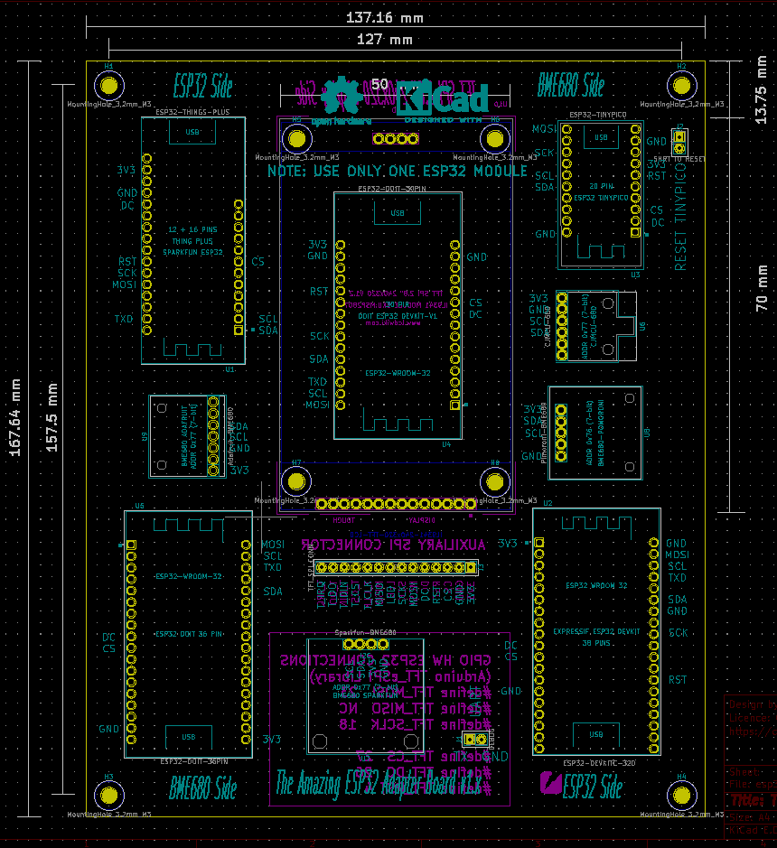

# The Amazing ESP32 Adapter Board v1.x

 This adapter board is used to create a nautical precision barometer with an unique pressure history function. This project is well documented in this [instructable](https://www.instructables.com). 

## Specification for `The Amazing ESP32 Adapter Board v1.x`

This adapter board is fabricated as two layer board with the dimensions 5.4"x6.6" (137.16 x 167.64 mm).

| parameter | imperial | metric |
| -----------|-------|------|
| board material | FR4 | FR4 |
| board thickness | 63 mil | 1.6 mm |
| M3 mounting holes | 1/8" | 3.2 mm |
| hole diameter | 39.4 mil | 1.0 mm |
| hole plating | HASL (with lead) | HASL (with lead) |
| copper on both side | yes | yes |
| copper layer thickness | 1.4 mil | 35 um |
| board color | green | green |
| board text | white | white |
| board weight | <0.56 oz> | TBD gram |

## Fabrication of the board by yourself

This project is open-source, so that you will find KiCad PCB board design files and gerbers in this repository. Therefore, feel free to modify these files to fit your specific need.

You can directly upload files in the fabrication/gerbers folder to a prototype service, such as [OSHPark](https://oshpark.com). 

## Other sources of the adapter board
You can also purchase the latest designed boards on `Tindie`. 

I appreciate your support.
